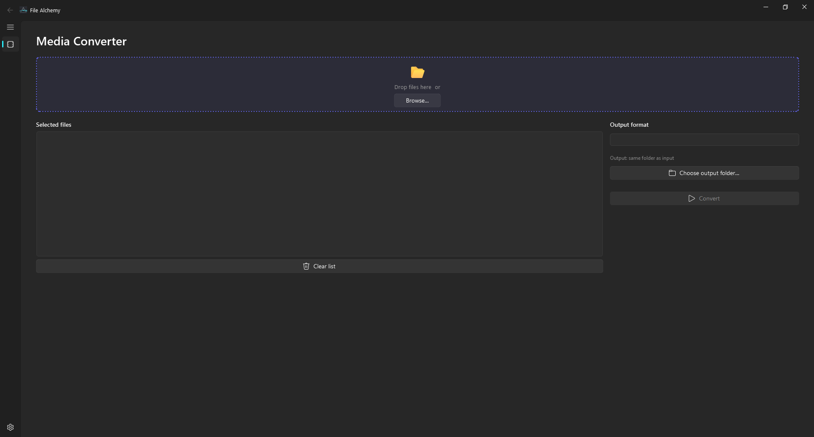

#  File Alchemy

[](https://github.com/Thomasssb1/file-alchemy/actions/workflows/ci.yml) [](https://github.com/Thomasssb1/file-alchemy/actions/workflows/ci.yml) [](https://github.com/Thomasssb1/file-alchemy/releases) [](https://github.com/Thomasssb1/file-alchemy/blob/main/LICENSE)

Universal file converter with FFmpeg integration and a modern Windows-inspired UI.



## Prerequisites

- Python ≥ 3.11
- [FFmpeg](https://ffmpeg.org/download.html) on PATH (required for media conversions)

## 1. Setup & Installation

```bash
# Create a virtual environment
python -m venv .venv

# Activate the virtual environment
# On Windows (PowerShell):
.venv\Scripts\Activate.ps1
# On macOS/Linux:
source .venv/bin/activate

# Install the application and development dependencies in editable mode
python -m pip install -e ".[dev]"
```

## 2. Running the Application

Make sure your virtual environment is activated, then run:

```bash
# Run the application
python -m file_alchemy

# Alternatively, since it's installed, you can just run:
file-alchemy
```

## 3. Testing

Tests run with coverage checks enabled by default (minimum 80% enforced). Ensure your virtual environment is activated:

```bash
# Run all tests (coverage runs automatically)
pytest

# Run only the UI component tests
pytest tests/test_media_page.py -v

# Generate an HTML coverage report
pytest --cov-report=html
```

Tests work headlessly in CI - `QT_QPA_PLATFORM=offscreen` is set automatically.

## 4. Linting

```bash
# Check for issues
ruff check .

# Auto-format
ruff format .
```

## 5. Building the Executable

To bundle the application into a distribution folder containing the executable and its dependencies, use the provided PyInstaller spec file.

Make sure your virtual environment is activated, then run this command from the root of the project:

```bash
pyinstaller "file_alchemy.spec"
```

- The final application and its compiled dependencies will be generated inside the `dist/File Alchemy/` folder. The exact executable name and layout may vary by platform and your PyInstaller configuration (for example, you may get a `.exe` on Windows).
- You can safely delete the `build/` folder that generates during the process.
